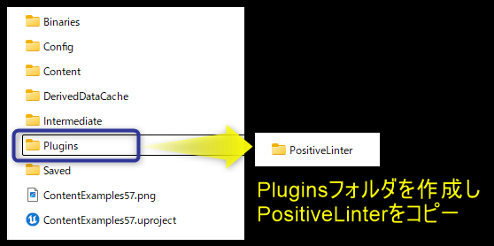
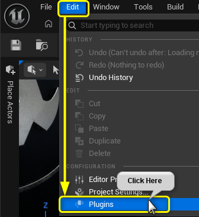
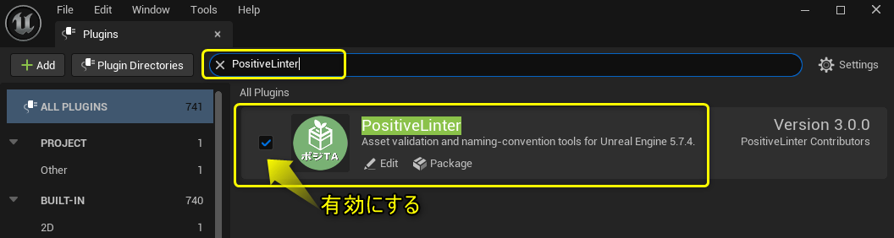
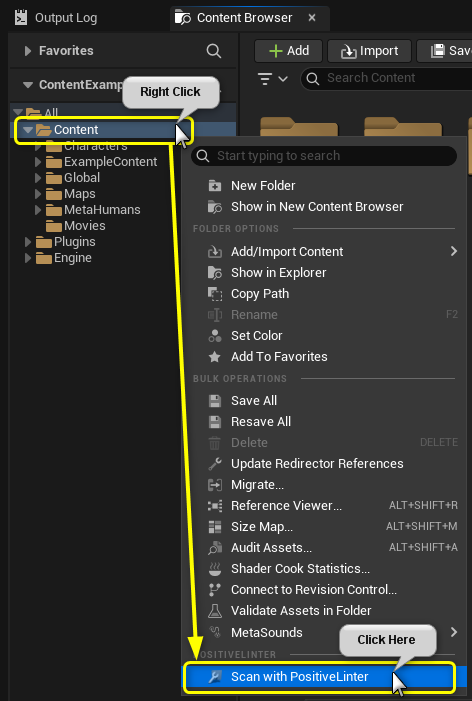
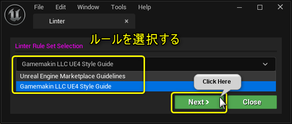
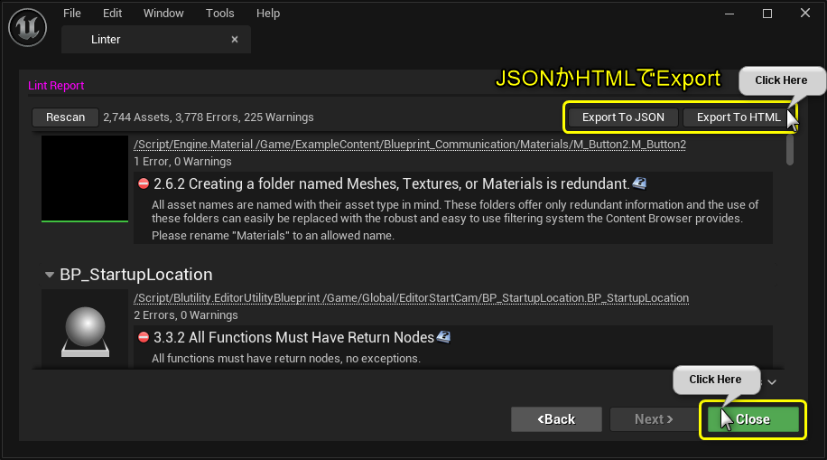

# はじめに

## 必要な環境

* Unreal Engine **5.7.4**
* プロジェクトを編集できる権限

## インストール

1. 起動中の Unreal Editor をすべて閉じます。
2. [`Plugins/PositiveLinter`](../Plugins/PositiveLinter) フォルダーを、対象プロジェクトの `Plugins` フォルダーへコピーします。

3. プロジェクトを Unreal Editor で開きます。

## PositiveLinter を有効にする

1. 対象プロジェクトを開きます。
2. メインツールバーで **Edit** を開き、**Plugins** を選択します。

3. `PositiveLinter` を検索し、有効でない場合は**Enabled** をオンにします。

4. OffからONにした場合はエディターを再起動します。

## PositiveLinter を使う

導入後の操作は次のとおりです。

1. Content Browser でスキャン対象のフォルダーを右クリックします。
2. **Scan with PositiveLinter** を選択します。

3. 使用するルールセットを選択し、NEXTボタンをクリックします。

Niagara・MetaSound などの UE5 アセットには **PositiveLinter UE5 Style Guide (UE 5.7.4)** を選択してください。対応クラスとルールの追加方法は[UE5 アセット用ルールの利用と拡張](ue5rules.md)で説明しています。

4. スキャンが完了するまで待ちます。

## Lint Report

スキャンが完了すると、選択した対象の検証結果をまとめた **Lint Report** が表示されます。
「Export To JSON」,「Export To HTML」をクリックすると外部ファイルとして結果を出力できます。
「CLOSE」をクリックすると終了します。

HTML レポートでは、指摘の一覧を重要度やアセットの種類で絞り込み、検索・ソートできます。詳細パネルから修正案を確認でき、絞り込み結果の全件を CSV に出力できます。操作方法と以前のレポートの変換方法は [HTML レポートの使い方](report.md)を参照してください。
