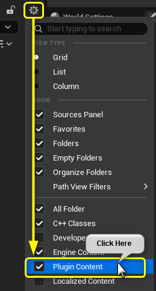
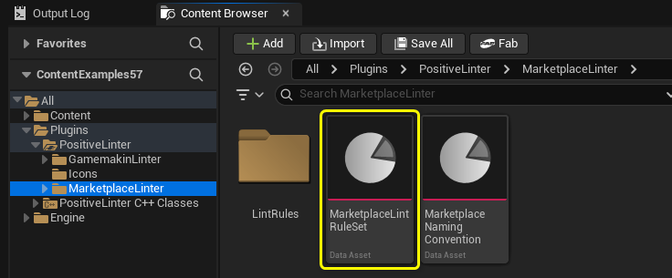
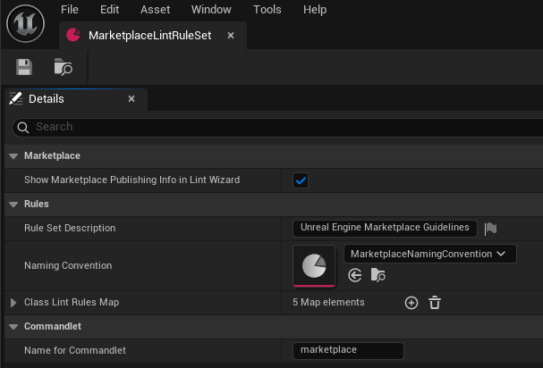
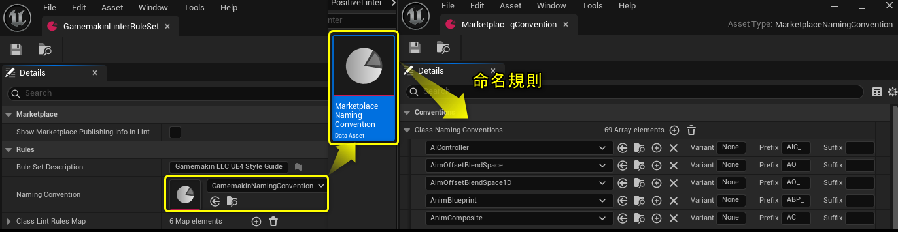
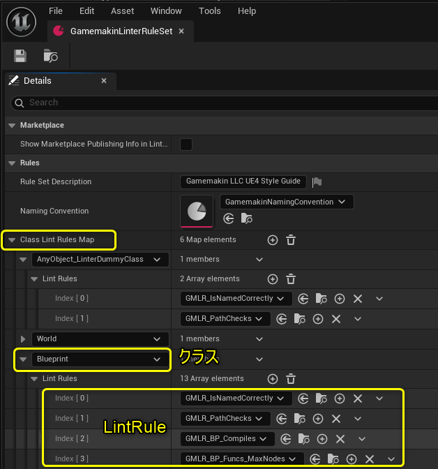

# Lint の仕組み

PositiveLinter に同梱されるルールセットは、プラグインのコンテンツフォルダーに含まれています。Engine プラグインおよび Project プラグインのコンテンツは、初期状態では Content Browser に表示されないことがあります。Content Browser の **Settings** で **Show Engine Content** と **Show Plugin Content** を有効にしてください。



## LintRuleSet の構成

UE5 の Niagara・MetaSound などを検証する場合は、[UE5 アセット用ルールの利用と拡張](ue5rules.md)を参照してください。追加の `UE5Linter` モジュールに、専用ルールセットと命名規約を用意しています。



ルールセットは `LintRuleSet` アセットで定義します。これは [Data Asset](https://www.youtube.com/watch?v=gLWXZ3FXhO8) の一種です。上の例では、Marketplace ガイドラインへの適合を確認するためのルールを定義した `MarketplaceLintRuleSet` アセットを開いています。



`LintRuleSet` のNamingConvertionには、`MarketplaceNamingConvention` のような `NamingConvention` Data Assetを設定できます。



さらに **Class Lint Rules Map** を持ちます。これは Unreal Engine のクラスと `LintRule` の一覧を対応付けるマップで、個々の検証ルールを構成します。



プロジェクト内のオブジェクトを検証するときは、Class Lint Rules Map にあるクラスのうち、対象アセットに対して最も具体的なクラスに対応するルールを実行します。どのクラスもマップに指定できますが、`UObject` は特別な扱いです。

UE 5.7.4 のエディターでは、Class Lint Rules Map のキーに `UObject` を直接指定できません。`UObject` 全般へ適用するルールを定義したい場合は、代わりに `AnyObject_LinterDummyClass` を使用してください。

たとえば上のルールセットでは、`UBlueprint` アセットには `UBlueprint` 用に定義された 4 つの LintRule が適用されます。`UBlueprint` は `UObject` より具体的なクラスだからです。Data Asset などの別のアセット型は、より具体的な一致がルールセットにない限り、`AnyObject_LinterDummyClass` のルールで検証されます。

**注記:** 現在、ルールをカスケードして実行する機能には対応していません。つまり、`UBlueprint` に対し、`UBlueprint` 用のルールと `UObject` 用のルールを同時に実行することはできません。

## LintRule の実装

`LintRule` は Blueprint と C++ のどちらでも実装できます。ただし、アセットメタデータや低レベルのアセット管理に関する機能は、Blueprint には十分公開されていません。検証ロジックは C++ に実装し、設定項目だけを Blueprint クラスに公開する方法を推奨します。

従来の同梱 `LintRule` は、ネイティブ C++ の `LintRule` を親に持つ Blueprint 子クラスです。Blueprint 側では主に設定値を公開します。`UE5Linter` の新規ルールは C++ クラスを直接登録して利用でき、Blueprint 子クラスで設定や検証内容を変更することもできます。

### PassesRule_Internal_Implementation

独自の `LintRule` を作成する際の中心となる関数が `PassesRule_Internal_Implementation` です。この関数は `BlueprintNativeEvent` のため、C++ と Blueprint のどちらでも実装できます。

検証ロジックはこの関数へ実装します。違反を検出した場合は `OutRuleViolations` 配列へ `FLintRuleViolation` を追加し、`false` を返します。違反が 1 件でもあれば必ず `false`、違反がなければ必ず `true` を返してください。`FLintRuleViolation` には、違反したアセット、違反したルール、および Lint Report に表示できる推奨対応メッセージが含まれます。

この関数を実装すれば `LintRule` として動作します。例として、テクスチャが大きすぎないことを確認するルールは次のように実装されています。

```cpp
bool ULintRule_Texture_Size_NotTooBig::PassesRule_Internal_Implementation(UObject* ObjectToLint, const ULintRuleSet* ParentRuleSet, TArray<FLintRuleViolation>& OutRuleViolations) const
{
	const UTexture2D* Texture = CastChecked<UTexture2D>(ObjectToLint);

	int32 TexSizeX = Texture->GetSizeX();
	int32 TexSizeY = Texture->GetSizeY();

	// Check to see if textures are too big
	if (TexSizeX > MaxTextureSizeX || TexSizeY > MaxTextureSizeY)
	{
		FText RecommendedAction = NSLOCTEXT("Linter", "LintRule_Texture_Size_NotTooBig_TooBig", "Please shrink your textures dimensions so that they fit within {0}x{1} pixels.");
		OutRuleViolations.Push(FLintRuleViolation(ObjectToLint, GetClass(), FText::FormatOrdered(RecommendedAction, MaxTextureSizeX, MaxTextureSizeY)));
		return false;
	}

	return true;
}
```

このコードは、`ObjectToLint` がテクスチャであり、その幅または高さが Blueprint 子クラスで設定された `MaxTextureSizeX` または `MaxTextureSizeY` を超えていないかを確認します。たとえば設定値が `8192` なら、8K を超えるテクスチャを検出できます。許容サイズを変える場合は Blueprint の値を編集するだけでよく、C++ の変更や再コンパイルは不要です。

ルールの表示情報は、ネイティブクラスの Blueprint 子クラスで設定することを推奨します。メッセージなどの文言を変更するだけなら、コードを編集せずに済みます。


### PassesRule は通常オーバーライド不要です

`LintRule` には `PassesRule` という仮想関数もあります。ここは通常の検証ロジックを置くための関数ではありません。これは Blueprint から `PassesRule_Internal_Implementation` を実装できるようにする公開 `BlueprintCallable` 関数です。

`PassesRule` を実装するのは、検証を早期に終了したい場合だけです。PositiveLinter の基本実装では、null チェックや無効なオブジェクトの処理を `PassesRule` で行い、実際の検証を `PassesRule_Internal_Implementation` で実行します。通常は独自の `PassesRule` を実装する必要はありません。

### IsRuleSuppressed は任意です

`IsRuleSuppressed` を実装すると、プログラムから `LintRule` を抑制できます。この関数は基本の `PassesRule` 実装から自動的に呼び出されます。ルールを無効化するだけなら、`PassesRule` ではなくこちらに実装してください。

## 命名規約の実装

`NamingConvention` アセットは、命名規約の一覧を持つ Data Asset です。`LintRule` は、親 `LintRuleSet` に設定された `NamingConvention` Data Asset へアクセスできます。`NamingConvention` 自体は検証ロジックを持ちません。`LintRule` がこのアセットを設定値として利用し、命名規約をチェックします。

## LintRuleCollection

複数のルールを 1 つのルールとして扱う方が分かりやすい場合があります。その場合は、他の `LintRule` の一覧を持つ `LintRuleCollection` を作成できます。繰り返し利用するパスやファイル名のルールをまとめる用途に便利です。

## Commandlet による自動検証

PositiveLinter は、コマンドラインからプロジェクトを検証するための Commandlet を追加します。検証処理自体に失敗した場合は終了コード `1` を返します。Lint Report にエラーが含まれる場合は終了コード `2` を返します。`-TreatWarningsAsErrors` を指定した場合は、警告も終了コード `2` の対象です。

Commandlet を実行するには、Editor のコマンドレット実行バイナリ、`.uproject` のパス、`-run=Linter` を順に指定します。Windows の例は次のとおりです。

```powershell
& "C:\Program Files\Epic Games\UE_5.7\Engine\Binaries\Win64\UnrealEditor-Cmd.exe" "C:\Projects\MyProject\MyProject.uproject" -run=Linter
```

このコマンドは `/Game`、つまりプロジェクトのコンテンツを検証します。違反がなければ終了コード `0` を返します。

### 使用する LintRuleSet を指定する

各 LintRuleSet には、コマンドラインから識別するための **Commandlet Name** フィールドがあります。

Gamemakin LLC UE4 Style Guide の Commandlet Name は `ue4.style`、Marketplace ルールセットは `marketplace` です。

`-RuleSet=` 引数でルールセットを指定できます。たとえば `-RuleSet=ue4.style` は Gamemakin のルールセットを、`-RuleSet=marketplace` は Marketplace ルールセットを使用します。`-RuleSet=` を省略した場合は、プロジェクトの既定 LintRuleSet が使用されます。

### 追加引数

#### コンテンツパス

スキャンするフォルダーを複数指定できます。通常は `/Game/...` 形式の Unreal Engine パスを使用します。パスに空白が含まれる場合は引用符で囲んでください。

たとえば、プロジェクトの `Content` フォルダー内にある `Apple` と `Orange Stuff` だけを検証するには、次のように実行します。

```powershell
& "C:\Program Files\Epic Games\UE_5.7\Engine\Binaries\Win64\UnrealEditor-Cmd.exe" "C:\Projects\MyProject\MyProject.uproject" /Game/Apple "/Game/Orange Stuff" -run=Linter
```

このコマンドは `Apple` と `Orange Stuff` の両フォルダーを検証します。`/Engine` やプラグインのコンテンツパスも指定できます。パスを指定しない場合の既定値は `/Game` です。

#### JSON レポート

`.json` レポートを生成するには `-json` を指定します。既定ではプロジェクトの `Saved/LintReports/` フォルダーに出力されます。`-json=ReportName.json` のように指定すればレポート名を変更できます。相対パスは `Saved/LintReports/` からの相対パスとして扱われ、絶対パスも指定できます。

#### HTML レポート

`.html` レポートを生成するには `-html` を指定します。既定ではプロジェクトの `Saved/LintReports/` フォルダーに出力されます。`-html=ReportName.html` でレポート名を変更できます。相対パスは `Saved/LintReports/` からの相対パスとして扱われ、絶対パスも指定できます。

#### TreatWarningsAsErrors

`-TreatWarningsAsErrors` を指定すると、レポートに警告が含まれる場合も終了コード `2` を返します。既定では、検証処理の失敗または Lint Report のエラーだけがエラー終了の対象です。
